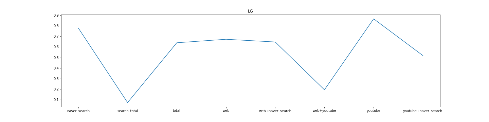

# Ajou-capital
기계학습 및 데이터마이닝 팀 프로젝트

## 검색 변화량과 주식 지표를 활용한 주가 예측

* 팀명 : Ajou캐피탈
* 팀원 : 김동현, 이은주, 전상범, 조규한, 홍소연
* 주제 : 검색 변화량과 주식 지표를 활용한 주가 예측
* 날짜 : 2020-06
* model : Linear Regression
* shape : 8*120 (8개의 feature, 120주)
* description : 9개의 회사별로 1주일 단위의 검색 변화량 지표와 주식 지표 120주의 데이터를 예측변수로 하여 각 주의 다음주 주가에 대한 영향력을 확인한다.

## r2 score 결과

